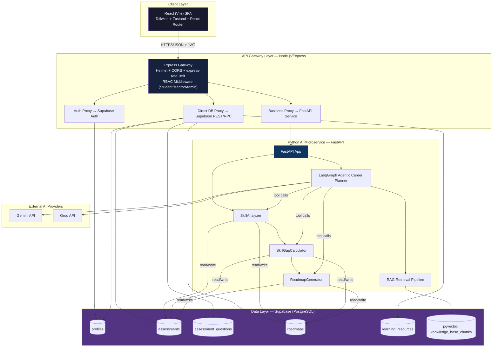
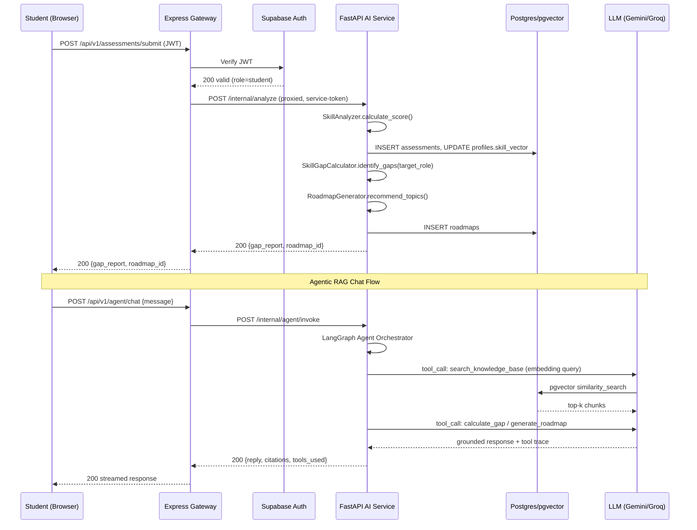
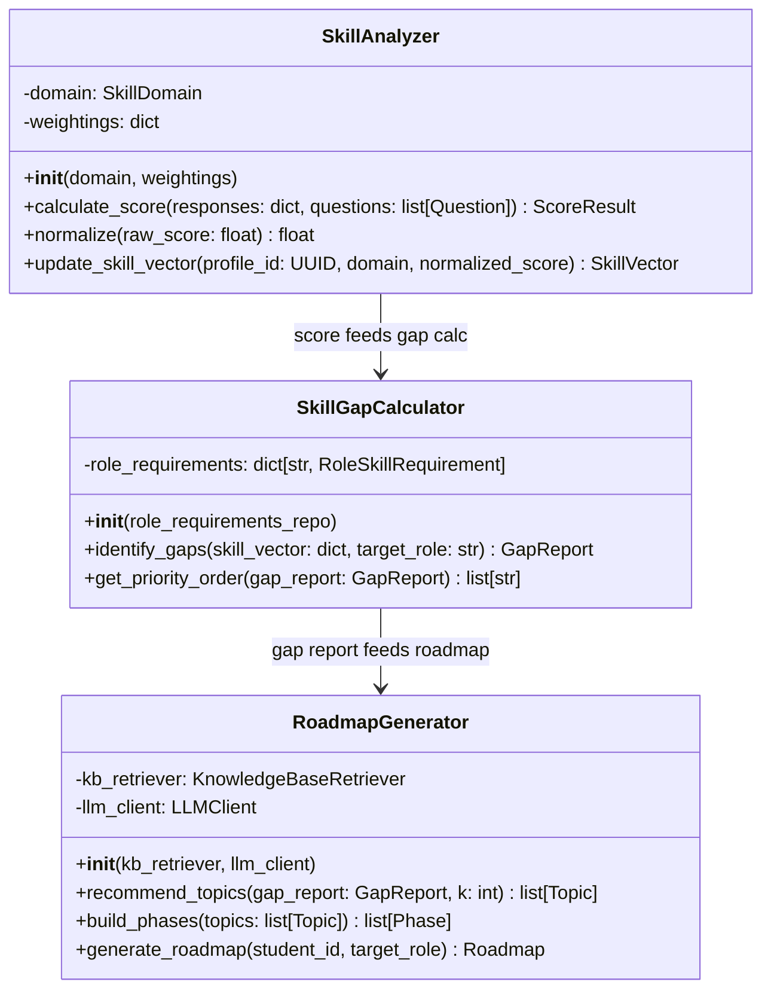
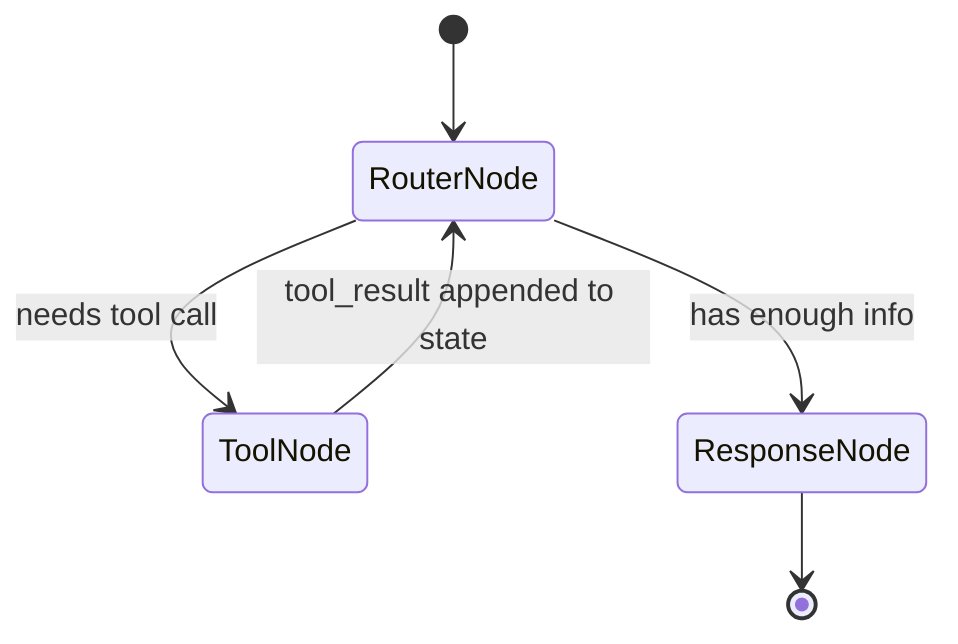

# PRD.md — SkillForge: AI-Powered Student Skills & Career Development Platform

**Document Version:** 1.0
**Status:** Final — Ready for Autonomous Agent Execution
**Owner:** Principal AI Architect / Technical PM
**Audience:** Autonomous AI Coding Agent (IDE Agent), Full-Stack Engineers, DevOps Engineers

---

## Table of Contents

1. [Executive Summary & System Vision](#1-executive-summary--system-vision)
2. [System Architecture & Data Flow](#2-system-architecture--data-flow)
3. [Database Schema & RLS Policy Matrix](#3-database-schema--rls-policy-matrix)
4. [Python OOP & AI Microservice Technical Specification](#4-python-oop--ai-microservice-technical-specification)
5. [API Gateway & Microservice REST Endpoints Contract](#5-api-gateway--microservice-rest-endpoints-contract)
6. [Frontend UI/UX Specification & Page Hierarchies](#6-frontend-uiux-specification--page-hierarchies)
7. [Security, Stability & Code Quality Rules](#7-security-stability--code-quality-rules)
8. [DevOps & Deployment Deliverables](#8-devops--deployment-deliverables)
9. [Step-by-Step Hackathon Demo Script](#9-step-by-step-hackathon-demo-script)

---

## 1. Executive Summary & System Vision

### 1.1 Problem Statement

Students entering technical fields face a **bimodal skill-development trap**:

- **The Specialization Trap:** Students obsess over one framework or language (e.g., only React) without understanding the surrounding ecosystem (Git workflows, deployment, databases, testing), leaving them unemployable for full-stack or infrastructure roles.
- **The Generalist Trap:** Students consume broad, shallow tutorial content across many domains without ever reaching job-ready depth in *any* single skill, resulting in a portfolio with no demonstrable competency.

Both traps stem from the same root cause: **the absence of a personalized, quantified, and continuously-updated map between a student's current skill state and the skill state required by a specific target role.** Career counseling at scale is unavailable to most students, and generic "roadmap" content on the internet is not personalized, not adaptive, and not grounded in the student's actual assessed ability.

### 1.2 Target Persona Pain Points

| Persona | Pain Point | SkillForge Resolution |
|---|---|---|
| Computer Science Undergraduate | "I don't know if I'm ready for a Backend Developer internship." | Dynamic assessment + quantified skill-gap score against role-specific skill vectors. |
| Bootcamp Graduate | "I've done 20 tutorials but have no structured path to a job." | AI-generated phased roadmap (Topics → Projects → Resources) with progress tracking. |
| Self-taught Developer | "I don't know what I don't know." | RAG-grounded Agentic Career Assistant that surfaces blind spots from a curated knowledge base. |
| University Career Mentor | "I can't manually audit 200 students' skill profiles." | Mentor/Admin dashboard with cohort-wide skill matrix visibility and targeted recommendation tools. |

### 1.3 Strategic SDG Mapping

| SDG | Alignment Mechanism |
|---|---|
| **SDG 4 — Quality Education** | Personalized, adaptive learning roadmaps grounded in verified skill assessments rather than one-size-fits-all curricula. |
| **SDG 8 — Decent Work & Economic Growth** | Directly closes the skill-to-employability gap by mapping assessed competency to real target-role requirements, improving job-readiness and reducing underemployment. |
| **SDG 9 — Industry, Innovation & Infrastructure** | Demonstrates a production-grade, containerized, cloud-native microservice architecture (FastAPI + LangGraph + Kubernetes) as a reusable innovation pattern for EdTech infrastructure. |
| **SDG 10 — Reduced Inequalities** | Removes the cost/access barrier of 1:1 human career counseling by providing free, scalable, AI-driven mentorship — disproportionately benefiting students without access to institutional career services. |

### 1.4 System Vision Statement

> SkillForge is a full-stack, agentic AI platform that ingests a student's real skill signals (assessments + resume parsing), quantifies the delta against any target job role via a deterministic Python analytics engine, and closes that delta through a personalized, RAG-grounded, conversational roadmap — all delivered through a role-based (Student / Mentor / Admin) platform built on a strictly-typed, containerized microservice architecture.

### 1.5 Non-Goals (Explicit Out-of-Scope for Hackathon Build)

- No payment/billing system.
- No native mobile app (responsive web only).
- No real-time video mentorship (asynchronous only).
- No third-party job-board scraping/integration (role skill vectors are curated/seeded, not live-scraped).

---

## 2. System Architecture & Data Flow

### 2.1 High-Level Architecture Diagram



### 2.2 Request Lifecycle (Sequence)



### 2.3 Directory-to-Layer Mapping

| Layer | Directory | Responsibility |
|---|---|---|
| Client | `client/` | React SPA — all UI, state, routing |
| Gateway | `api-gateway/` | AuthN verification, RBAC, rate limiting, request proxying, no business logic |
| AI Service | `ai-service/` | All analytics (OOP classes), RAG pipeline, LangGraph agent, Pydantic contracts |
| Infra | `devops/` | Docker, K8s, Terraform, CI/CD, bash automation |

### 2.4 Boundary Rule (Critical for Agent)

> **The Express Gateway NEVER contains business/analytics logic.** It is strictly: authenticate → authorize (role check) → rate-limit → forward. All skill scoring, gap calculation, and roadmap generation MUST live in the Python FastAPI service. Direct CRUD reads (e.g., fetching a learning resource list) MAY bypass the FastAPI service and hit Supabase directly via the gateway's Supabase service client, governed by RLS.

---

## 3. Database Schema & RLS Policy Matrix

### 3.1 Enum Types

```sql
CREATE TYPE user_role AS ENUM ('student', 'mentor', 'admin');
CREATE TYPE skill_domain AS ENUM ('python', 'web', 'git', 'devops', 'ai', 'databases');
CREATE TYPE proficiency_level AS ENUM ('novice', 'beginner', 'intermediate', 'advanced', 'expert');
CREATE TYPE assessment_status AS ENUM ('not_started', 'in_progress', 'completed', 'expired');
CREATE TYPE roadmap_status AS ENUM ('draft', 'active', 'completed', 'archived');
CREATE TYPE resource_type AS ENUM ('article', 'video', 'course', 'project', 'documentation', 'book');
CREATE TYPE task_status AS ENUM ('pending', 'in_progress', 'done', 'skipped');
```

### 3.2 Table: `profiles`

```sql
CREATE TABLE profiles (
    id UUID PRIMARY KEY REFERENCES auth.users(id) ON DELETE CASCADE,
    full_name TEXT NOT NULL,
    email TEXT UNIQUE NOT NULL,
    role user_role NOT NULL DEFAULT 'student',
    avatar_url TEXT,
    bio TEXT,
    target_role TEXT,                      -- e.g. "Backend Developer", "ML Engineer"
    resume_url TEXT,                       -- Supabase Storage path
    parsed_resume_skills JSONB DEFAULT '[]'::jsonb,  -- extracted skill tags from resume parser
    skill_vector JSONB DEFAULT '{}'::jsonb,          -- {"python": 0.72, "web": 0.55, ...} normalized 0-1
    onboarding_completed BOOLEAN NOT NULL DEFAULT false,
    created_at TIMESTAMPTZ NOT NULL DEFAULT now(),
    updated_at TIMESTAMPTZ NOT NULL DEFAULT now()
);

CREATE INDEX idx_profiles_role ON profiles(role);
CREATE INDEX idx_profiles_target_role ON profiles(target_role);
```

### 3.3 Table: `assessment_questions`

```sql
CREATE TABLE assessment_questions (
    id UUID PRIMARY KEY DEFAULT gen_random_uuid(),
    domain skill_domain NOT NULL,
    difficulty proficiency_level NOT NULL,
    question_text TEXT NOT NULL,
    options JSONB NOT NULL,                -- [{"id":"a","text":"..."}, ...]
    correct_option_id TEXT NOT NULL,
    explanation TEXT,
    weight NUMERIC(3,2) NOT NULL DEFAULT 1.00 CHECK (weight BETWEEN 0.1 AND 5.0),
    created_by UUID REFERENCES profiles(id) ON DELETE SET NULL,
    is_active BOOLEAN NOT NULL DEFAULT true,
    created_at TIMESTAMPTZ NOT NULL DEFAULT now()
);

CREATE INDEX idx_questions_domain_difficulty ON assessment_questions(domain, difficulty);
CREATE INDEX idx_questions_active ON assessment_questions(is_active) WHERE is_active = true;
```

### 3.4 Table: `assessments`

```sql
CREATE TABLE assessments (
    id UUID PRIMARY KEY DEFAULT gen_random_uuid(),
    student_id UUID NOT NULL REFERENCES profiles(id) ON DELETE CASCADE,
    domain skill_domain NOT NULL,
    status assessment_status NOT NULL DEFAULT 'not_started',
    question_ids UUID[] NOT NULL,
    responses JSONB DEFAULT '{}'::jsonb,   -- {"<question_id>": "<option_id>"}
    raw_score NUMERIC(5,2),                -- 0-100
    normalized_score NUMERIC(3,2),         -- 0.00-1.00, fed into profiles.skill_vector
    started_at TIMESTAMPTZ,
    completed_at TIMESTAMPTZ,
    time_limit_seconds INTEGER NOT NULL DEFAULT 1800,
    created_at TIMESTAMPTZ NOT NULL DEFAULT now(),
    CONSTRAINT chk_score_range CHECK (raw_score IS NULL OR (raw_score >= 0 AND raw_score <= 100))
);

CREATE INDEX idx_assessments_student ON assessments(student_id);
CREATE INDEX idx_assessments_domain_status ON assessments(domain, status);
```

### 3.5 Table: `roadmaps`

```sql
CREATE TABLE roadmaps (
    id UUID PRIMARY KEY DEFAULT gen_random_uuid(),
    student_id UUID NOT NULL REFERENCES profiles(id) ON DELETE CASCADE,
    target_role TEXT NOT NULL,
    status roadmap_status NOT NULL DEFAULT 'draft',
    gap_summary JSONB NOT NULL,            -- {"python": {"current":0.4,"required":0.8,"gap":0.4}, ...}
    phases JSONB NOT NULL,                 -- see 3.5.1 shape below
    generated_by TEXT NOT NULL DEFAULT 'ai-agent', -- 'ai-agent' | 'mentor:<uuid>'
    version INTEGER NOT NULL DEFAULT 1,
    created_at TIMESTAMPTZ NOT NULL DEFAULT now(),
    updated_at TIMESTAMPTZ NOT NULL DEFAULT now()
);

CREATE INDEX idx_roadmaps_student ON roadmaps(student_id);
CREATE INDEX idx_roadmaps_status ON roadmaps(status);
```

**3.5.1 `phases` JSONB shape (contract for frontend timeline):**

```json
[
  {
    "phase_number": 1,
    "title": "Foundations: Python & Git",
    "topics": [
      {
        "id": "uuid",
        "name": "Python OOP Fundamentals",
        "status": "pending",
        "projects": [{"title": "Build a CLI inventory app", "resource_ids": ["uuid"]}],
        "resources": [{"id": "uuid", "type": "course", "title": "...", "url": "..."}]
      }
    ]
  }
]
```

### 3.6 Table: `learning_resources`

```sql
CREATE TABLE learning_resources (
    id UUID PRIMARY KEY DEFAULT gen_random_uuid(),
    title TEXT NOT NULL,
    description TEXT,
    url TEXT NOT NULL,
    type resource_type NOT NULL,
    domain skill_domain NOT NULL,
    difficulty proficiency_level NOT NULL,
    tags TEXT[] DEFAULT '{}',
    curated_by UUID REFERENCES profiles(id) ON DELETE SET NULL,
    is_active BOOLEAN NOT NULL DEFAULT true,
    created_at TIMESTAMPTZ NOT NULL DEFAULT now()
);

CREATE INDEX idx_resources_domain_type ON learning_resources(domain, type);
CREATE INDEX idx_resources_tags ON learning_resources USING GIN(tags);
```

### 3.7 Table: `knowledge_base_chunks` (pgvector)

```sql
CREATE EXTENSION IF NOT EXISTS vector;

CREATE TABLE knowledge_base_chunks (
    id UUID PRIMARY KEY DEFAULT gen_random_uuid(),
    source_title TEXT NOT NULL,
    source_type TEXT NOT NULL,             -- 'role_roadmap' | 'tech_doc' | 'project_idea'
    domain skill_domain,
    content TEXT NOT NULL,
    embedding VECTOR(768),                 -- Gemini text-embedding-004 dimension
    metadata JSONB DEFAULT '{}'::jsonb,
    created_at TIMESTAMPTZ NOT NULL DEFAULT now()
);

CREATE INDEX idx_kb_embedding ON knowledge_base_chunks
    USING ivfflat (embedding vector_cosine_ops) WITH (lists = 100);
```

### 3.8 Row Level Security (RLS) Policy Matrix

```sql
ALTER TABLE profiles ENABLE ROW LEVEL SECURITY;
ALTER TABLE assessments ENABLE ROW LEVEL SECURITY;
ALTER TABLE assessment_questions ENABLE ROW LEVEL SECURITY;
ALTER TABLE roadmaps ENABLE ROW LEVEL SECURITY;
ALTER TABLE learning_resources ENABLE ROW LEVEL SECURITY;
ALTER TABLE knowledge_base_chunks ENABLE ROW LEVEL SECURITY;

-- Helper: is_mentor_or_admin()
CREATE OR REPLACE FUNCTION is_mentor_or_admin() RETURNS BOOLEAN AS $$
  SELECT EXISTS (
    SELECT 1 FROM profiles WHERE id = auth.uid() AND role IN ('mentor','admin')
  );
$$ LANGUAGE sql SECURITY DEFINER STABLE;

-- profiles
CREATE POLICY "profiles_select_own_or_staff" ON profiles FOR SELECT
  USING (id = auth.uid() OR is_mentor_or_admin());
CREATE POLICY "profiles_update_own" ON profiles FOR UPDATE
  USING (id = auth.uid()) WITH CHECK (id = auth.uid());
CREATE POLICY "profiles_insert_self" ON profiles FOR INSERT
  WITH CHECK (id = auth.uid());

-- assessments
CREATE POLICY "assessments_select_own_or_staff" ON assessments FOR SELECT
  USING (student_id = auth.uid() OR is_mentor_or_admin());
CREATE POLICY "assessments_insert_own" ON assessments FOR INSERT
  WITH CHECK (student_id = auth.uid());
CREATE POLICY "assessments_update_own" ON assessments FOR UPDATE
  USING (student_id = auth.uid()) WITH CHECK (student_id = auth.uid());

-- assessment_questions
CREATE POLICY "questions_select_all_authenticated" ON assessment_questions FOR SELECT
  USING (auth.role() = 'authenticated' AND is_active = true);
CREATE POLICY "questions_write_staff_only" ON assessment_questions FOR ALL
  USING (is_mentor_or_admin()) WITH CHECK (is_mentor_or_admin());

-- roadmaps
CREATE POLICY "roadmaps_select_own_or_staff" ON roadmaps FOR SELECT
  USING (student_id = auth.uid() OR is_mentor_or_admin());
CREATE POLICY "roadmaps_insert_own_or_service" ON roadmaps FOR INSERT
  WITH CHECK (student_id = auth.uid() OR is_mentor_or_admin());
CREATE POLICY "roadmaps_update_own_or_staff" ON roadmaps FOR UPDATE
  USING (student_id = auth.uid() OR is_mentor_or_admin());

-- learning_resources
CREATE POLICY "resources_select_all_authenticated" ON learning_resources FOR SELECT
  USING (auth.role() = 'authenticated' AND is_active = true);
CREATE POLICY "resources_write_staff_only" ON learning_resources FOR ALL
  USING (is_mentor_or_admin()) WITH CHECK (is_mentor_or_admin());

-- knowledge_base_chunks (service-role only; no direct client access)
CREATE POLICY "kb_no_client_access" ON knowledge_base_chunks FOR ALL
  USING (false);
```

### 3.9 Role Access Summary Table

| Table | Student | Mentor | Admin |
|---|---|---|---|
| profiles | R/W own | R all, W own | R/W all |
| assessments | R/W own | R all | R/W all |
| assessment_questions | R (active only) | R/W | R/W |
| roadmaps | R/W own | R/W all | R/W all |
| learning_resources | R (active only) | R/W | R/W |
| knowledge_base_chunks | none (service-role only via FastAPI) | none | none |

---

## 4. Python OOP & AI Microservice Technical Specification

### 4.1 Class Diagram Overview



### 4.2 `SkillAnalyzer` — Full Specification

```python
# ai-service/app/core/skill_analyzer.py
from dataclasses import dataclass
from uuid import UUID
from app.schemas.assessment import Question, ScoreResult

class SkillAnalyzer:
    """Deterministic scoring engine for a single skill domain assessment."""

    def __init__(self, domain: str, weightings: dict[str, float] | None = None):
        self.domain = domain
        # weightings keyed by difficulty: novice..expert, defaults sum-normalized
        self.weightings = weightings or {
            "novice": 0.5, "beginner": 0.75, "intermediate": 1.0,
            "advanced": 1.5, "expert": 2.0
        }

    def calculate_score(self, responses: dict[str, str], questions: list[Question]) -> ScoreResult:
        """
        responses: {question_id: selected_option_id}
        Returns ScoreResult(raw_score: float[0-100], correct_count: int, total_weight: float)
        Formula: sum(weight_i * difficulty_multiplier_i for correct_i) / sum(all possible) * 100
        """
        ...

    def normalize(self, raw_score: float) -> float:
        """Clamps and scales raw_score (0-100) to normalized_score (0.00-1.00), rounded to 2dp."""
        return round(max(0.0, min(raw_score, 100.0)) / 100.0, 2)

    def update_skill_vector(self, profile_id: UUID, domain: str, normalized_score: float) -> dict:
        """
        Merges {domain: normalized_score} into profiles.skill_vector JSONB via Supabase client.
        Uses exponential moving average if a prior score exists: new = 0.6*new + 0.4*old
        (prevents single-assessment volatility from wiping prior signal).
        """
        ...
```

### 4.3 `SkillGapCalculator` — Full Specification

```python
# ai-service/app/core/skill_gap_calculator.py
from app.schemas.roadmap import GapReport, RoleSkillRequirement

class SkillGapCalculator:
    """Computes delta between a student's skill_vector and a target role's required vector."""

    def __init__(self, role_requirements_repo):
        self.role_requirements_repo = role_requirements_repo  # seeded table/config

    def identify_gaps(self, skill_vector: dict[str, float], target_role: str) -> GapReport:
        """
        1. Fetch RoleSkillRequirement for target_role (e.g. {"python":0.8,"web":0.7,"git":0.6,
           "devops":0.5,"ai":0.4,"databases":0.6})
        2. For each domain: gap = max(0, required - current); current defaults to 0.0 if unassessed
        3. Returns GapReport{ per_domain: {domain: {current, required, gap}}, overall_readiness: float }
        overall_readiness = 1 - (sum(gaps) / sum(requirements))
        """
        ...

    def get_priority_order(self, gap_report: GapReport) -> list[str]:
        """Returns domains sorted descending by gap size — largest gap first."""
        return sorted(gap_report.per_domain, key=lambda d: gap_report.per_domain[d]["gap"], reverse=True)
```

### 4.4 `RoadmapGenerator` — Full Specification

```python
# ai-service/app/core/roadmap_generator.py
from app.schemas.roadmap import Topic, Phase, Roadmap
from app.rag.retriever import KnowledgeBaseRetriever
from app.ai.llm_client import LLMClient

class RoadmapGenerator:
    """Converts a GapReport into a grounded, phased learning roadmap."""

    def __init__(self, kb_retriever: KnowledgeBaseRetriever, llm_client: LLMClient):
        self.kb_retriever = kb_retriever
        self.llm_client = llm_client

    def recommend_topics(self, gap_report, k: int = 5) -> list[Topic]:
        """
        For each domain in priority order (largest gap first):
          - embed a query string "{domain} topics for {target_role} at gap-adjusted difficulty"
          - kb_retriever.similarity_search(query_embedding, domain=domain, top_k=k)
          - map retrieved chunks -> Topic objects with linked learning_resources
        """
        ...

    def build_phases(self, topics: list[Topic]) -> list[Phase]:
        """
        Groups topics into 3-5 sequential phases (Foundations -> Core -> Applied -> Advanced -> Capstone)
        based on proficiency_level metadata on each topic's source chunk.
        """
        ...

    def generate_roadmap(self, student_id, target_role: str) -> Roadmap:
        """Orchestrates: fetch skill_vector -> gap_calc -> recommend_topics -> build_phases -> persist."""
        ...
```

### 4.5 RAG Knowledge Base — Chunking & Retrieval Strategy

| Parameter | Value | Rationale |
|---|---|---|
| Chunk size | 300–500 tokens | Preserves topic coherence for career-roadmap prose |
| Chunk overlap | 50 tokens | Prevents context loss at chunk boundaries |
| Embedding model | Gemini `text-embedding-004` (768-dim) | Matches `pgvector` column dimension |
| Similarity metric | Cosine (`vector_cosine_ops`) | Standard for normalized text embeddings |
| Index type | IVFFlat, lists=100 | Balances recall/speed for hackathon-scale KB (~5k-20k chunks) |
| Retrieval top-k | 5 (configurable) | Sufficient grounding without prompt bloat |
| Source corpus | Curated role roadmaps, official tech docs summaries, project-idea briefs | Ensures grounded, non-hallucinated recommendations |

**Retrieval pipeline (`app/rag/retriever.py`):**
1. Embed query via Gemini embedding endpoint.
2. `SELECT content, source_title, metadata FROM knowledge_base_chunks ORDER BY embedding <=> $1 LIMIT $k` (optionally filtered by `domain`).
3. Return `list[RetrievedChunk]` with `content`, `source_title`, `similarity_score`.

### 4.6 Agentic AI — LangGraph Tool Definitions & State Schema

**4.6.1 Agent State (Pydantic)**

```python
# ai-service/app/agent/state.py
from pydantic import BaseModel
from typing import Optional

class AgentState(BaseModel):
    student_id: str
    target_role: Optional[str] = None
    conversation_history: list[dict] = []
    tool_trace: list[str] = []
    last_gap_report: Optional[dict] = None
    last_roadmap_id: Optional[str] = None
    final_response: Optional[str] = None
```

**4.6.2 Tool Definitions (4 explicit tools)**

```python
# ai-service/app/agent/tools.py
from langchain.tools import tool
from pydantic import BaseModel, Field

class AnalyzeStudentSkillsInput(BaseModel):
    student_id: str = Field(..., description="UUID of the student profile")

@tool("analyze_student_skills", args_schema=AnalyzeStudentSkillsInput)
def analyze_student_skills(student_id: str) -> dict:
    """Fetches the student's current skill_vector and recent assessment history from Supabase."""
    ...

class SearchKnowledgeBaseInput(BaseModel):
    query: str = Field(..., description="Natural language search query")
    domain: str | None = Field(None, description="Optional skill_domain filter")
    top_k: int = Field(5, ge=1, le=10)

@tool("search_knowledge_base", args_schema=SearchKnowledgeBaseInput)
def search_knowledge_base(query: str, domain: str | None = None, top_k: int = 5) -> list[dict]:
    """Performs pgvector similarity search over the curated career/tech knowledge base."""
    ...

class CalculateGapInput(BaseModel):
    student_id: str
    target_role: str = Field(..., description="Target job role, e.g. 'Backend Developer'")

@tool("calculate_gap", args_schema=CalculateGapInput)
def calculate_gap(student_id: str, target_role: str) -> dict:
    """Invokes SkillGapCalculator.identify_gaps and returns a structured GapReport."""
    ...

class GenerateRoadmapInput(BaseModel):
    student_id: str
    target_role: str

@tool("generate_roadmap", args_schema=GenerateRoadmapInput)
def generate_roadmap(student_id: str, target_role: str) -> dict:
    """Invokes RoadmapGenerator.generate_roadmap, persists it, and returns the roadmap_id + summary."""
    ...
```

**4.6.3 Prompt Constraints (System Prompt Contract)**

```
You are the SkillForge Career Copilot. Rules:
1. NEVER fabricate skill scores, gap percentages, or resource URLs — always call a tool.
2. If asked about the student's readiness, you MUST call analyze_student_skills and calculate_gap
   before answering.
3. Cite knowledge base sources by source_title when recommending topics/resources.
4. If target_role is not yet known, ask the student for it before calling calculate_gap or
   generate_roadmap.
5. Keep responses under 200 words unless the student explicitly asks for a detailed breakdown.
6. Never claim to have taken an action (e.g. "I've updated your roadmap") without a successful
   tool_result confirming it.
```

**4.6.4 LangGraph Graph Topology**



---

## 5. API Gateway & Microservice REST Endpoints Contract

### 5.1 Base Conventions

- Base path: `/api/v1`
- Auth: `Authorization: Bearer <supabase_jwt>` on all routes except `/auth/*` register/login.
- All error responses: `{ "error": { "code": "STRING", "message": "STRING" } }`
- Roles enforced via gateway middleware `requireRole(['student'])` etc.

### 5.2 Auth Endpoints

| Method | Path | Role | Description |
|---|---|---|---|
| POST | `/api/v1/auth/register` | public | Proxies Supabase signup; creates `profiles` row |
| POST | `/api/v1/auth/login` | public | Proxies Supabase password grant |
| POST | `/api/v1/auth/refresh` | public | Refresh token exchange |
| GET | `/api/v1/auth/me` | any authenticated | Returns current profile |

**POST /api/v1/auth/register**
```json
// Request
{ "email": "student@example.com", "password": "SecurePass123!", "full_name": "Aisha Khan", "role": "student" }
// Response 201
{ "user_id": "uuid", "access_token": "jwt", "refresh_token": "jwt" }
```

### 5.3 Student Profile Endpoints

| Method | Path | Role | Description |
|---|---|---|---|
| GET | `/api/v1/profile` | student | Get own profile |
| PATCH | `/api/v1/profile` | student | Update bio, target_role, avatar |
| POST | `/api/v1/profile/resume` | student | Upload resume (multipart) → triggers parse |
| GET | `/api/v1/profile/skill-vector` | student | Get current skill_vector |

**POST /api/v1/profile/resume**
```json
// Response 202 (async parse job)
{ "job_id": "uuid", "status": "processing" }
// Webhook/poll GET /api/v1/profile/resume/:job_id
{ "status": "completed", "parsed_skills": ["python", "flask", "docker"], "updated_profile": {} }
```

### 5.4 Assessment Endpoints

| Method | Path | Role | Description |
|---|---|---|---|
| GET | `/api/v1/assessments/available?domain=python` | student | List assessable domains/question counts |
| POST | `/api/v1/assessments/start` | student | Create new assessment instance |
| PATCH | `/api/v1/assessments/:id/answer` | student | Submit single answer (autosave) |
| POST | `/api/v1/assessments/:id/submit` | student | Finalize → triggers FastAPI scoring |
| GET | `/api/v1/assessments/:id` | student/staff | Get assessment detail/result |
| POST | `/api/v1/assessments/questions` | mentor/admin | Create question |
| PUT | `/api/v1/assessments/questions/:id` | mentor/admin | Edit question |

**POST /api/v1/assessments/start**
```json
// Request
{ "domain": "python" }
// Response 201
{ "assessment_id": "uuid", "questions": [{"id":"uuid","question_text":"...","options":[{"id":"a","text":"..."}]}], "time_limit_seconds": 1800 }
```

**POST /api/v1/assessments/:id/submit**
```json
// Response 200
{
  "assessment_id": "uuid",
  "raw_score": 78.5,
  "normalized_score": 0.79,
  "domain": "python",
  "updated_skill_vector": { "python": 0.79, "web": 0.55 }
}
```

### 5.5 Skill Gap Engine Endpoints

| Method | Path | Role | Description |
|---|---|---|---|
| POST | `/api/v1/gap-analysis` | student | Compute gap report for target_role |
| GET | `/api/v1/gap-analysis/latest` | student | Fetch last computed gap report |

**POST /api/v1/gap-analysis**
```json
// Request
{ "target_role": "Backend Developer" }
// Response 200
{
  "overall_readiness": 0.62,
  "per_domain": {
    "python": {"current": 0.79, "required": 0.8, "gap": 0.01},
    "databases": {"current": 0.3, "required": 0.6, "gap": 0.3},
    "devops": {"current": 0.1, "required": 0.5, "gap": 0.4}
  },
  "priority_order": ["devops", "databases", "web"]
}
```

### 5.6 Roadmap Generation Endpoints

| Method | Path | Role | Description |
|---|---|---|---|
| POST | `/api/v1/roadmaps/generate` | student | Trigger full roadmap generation |
| GET | `/api/v1/roadmaps/:id` | student/staff | Fetch roadmap detail |
| PATCH | `/api/v1/roadmaps/:id/topics/:topicId/status` | student | Toggle topic status (pending/in_progress/done) |
| GET | `/api/v1/roadmaps/active` | student | Get current active roadmap |

**POST /api/v1/roadmaps/generate**
```json
// Request
{ "target_role": "Backend Developer" }
// Response 201
{
  "roadmap_id": "uuid",
  "status": "active",
  "phases": [
    {
      "phase_number": 1,
      "title": "Foundations: DevOps & Databases",
      "topics": [
        {"id":"uuid","name":"Docker Fundamentals","status":"pending",
         "resources":[{"id":"uuid","type":"course","title":"Docker for Beginners","url":"https://..."}]}
      ]
    }
  ]
}
```

### 5.7 AI Agent Chat Endpoint

| Method | Path | Role | Description |
|---|---|---|---|
| POST | `/api/v1/agent/chat` | student | Send message to Career Copilot (streaming SSE) |
| GET | `/api/v1/agent/history` | student | Fetch conversation history |

**POST /api/v1/agent/chat**
```json
// Request
{ "message": "What should I learn next to become job-ready for backend roles?", "session_id": "uuid" }
// Response 200 (SSE stream, final event shown)
{
  "reply": "Based on your gap analysis, focus on Docker and SQL next...",
  "tools_used": ["analyze_student_skills", "calculate_gap", "search_knowledge_base"],
  "citations": [{"source_title": "Backend Developer Roadmap 2026", "chunk_id": "uuid"}]
}
```

### 5.8 Mentor/Admin Endpoints

| Method | Path | Role | Description |
|---|---|---|---|
| GET | `/api/v1/admin/students` | mentor/admin | Paginated student directory with skill summary |
| GET | `/api/v1/admin/students/:id` | mentor/admin | Full student profile + assessments + roadmap |
| POST | `/api/v1/admin/resources` | mentor/admin | Create learning resource |
| PUT | `/api/v1/admin/resources/:id` | mentor/admin | Edit resource |
| DELETE | `/api/v1/admin/resources/:id` | mentor/admin | Soft-delete (is_active=false) |
| POST | `/api/v1/admin/recommendations` | mentor | Send targeted mentorship note to a student |

### 5.9 Standard Error Codes

| Code | HTTP Status | Meaning |
|---|---|---|
| `AUTH_INVALID_TOKEN` | 401 | JWT missing/expired/invalid |
| `AUTH_FORBIDDEN_ROLE` | 403 | Role does not permit this action |
| `VALIDATION_ERROR` | 422 | Pydantic/Zod schema validation failed |
| `RATE_LIMITED` | 429 | Exceeded express-rate-limit threshold |
| `RESOURCE_NOT_FOUND` | 404 | Entity ID not found or RLS-blocked |
| `AI_SERVICE_UNAVAILABLE` | 502 | FastAPI service unreachable/timeout |
| `INTERNAL_ERROR` | 500 | Unhandled exception |

---

## 6. Frontend UI/UX Specification & Page Hierarchies

### 6.1 Design System

- **Theme:** High-contrast dark UI. Background `#0B0E14`, surface `#141824`, accent `#6366F1` (indigo), success `#22C55E`, warning `#F59E0B`, danger `#EF4444`.
- **Typography:** `Inter` for UI text, `JetBrains Mono` for code/scores.
- **Icons:** Lucide React exclusively — no mixed icon libraries.
- **Spacing:** Tailwind 4px base scale; card radius `rounded-2xl`; consistent `shadow-lg shadow-black/40`.

### 6.2 Route Hierarchy (React Router)

```
/                         → Landing (public)
/auth/login               → Login
/auth/register            → Register (role select)
/onboarding                → Post-signup profile setup (student)
/dashboard                 → Student Dashboard (protected: student)
/assessments                → Assessment domain picker
/assessments/:id/take       → Dynamic Quiz Interface
/assessments/:id/results    → Result breakdown
/roadmap                    → Interactive Vertical Timeline Roadmap
/roadmap/history            → Past roadmap versions
/copilot                    → Full-page AI Assistant (also available as Drawer)
/profile                    → Profile & Resume management
/admin                      → Admin/Mentor Dashboard (protected: mentor|admin)
/admin/students             → Student directory & audit
/admin/students/:id         → Individual student deep-dive
/admin/resources            → Learning resource CRUD
/admin/questions             → Assessment question bank CRUD
```

### 6.3 Student Dashboard Layout

```
┌─────────────────────────────────────────────────────────┐
│ TopNav: Logo | Target Role Selector | Avatar/Menu         │
├───────────────┬─────────────────────────────────────────┤
│ Sidebar:        │  Header: "Welcome back, {name}"         │
│ - Dashboard      │  ┌───────────────┬───────────────────┐ │
│ - Assessments    │  │ Overall        │ Skill Matrix       │ │
│ - Roadmap        │  │ Readiness      │ Widget (radar/bar) │ │
│ - Copilot         │  │ Ring Gauge     │                    │ │
│ - Profile          │  └───────────────┴───────────────────┘ │
│                    │  Active Roadmap Preview (mini timeline)  │
│                    │  Recent Assessments Table                │
│                    │  Recommended Next Action (CTA card)      │
└───────────────┴─────────────────────────────────────────┘
[Floating AI Assistant Drawer trigger — bottom right]
```

### 6.4 Skill Matrix Widget

- Component: `<SkillMatrixWidget skillVector={} requiredVector={} />`
- Renders a radar chart (6 axes: python, web, git, devops, ai, databases) overlaying current vs. required vectors for `target_role`.
- Zustand slice: `useSkillStore` holds `skillVector`, `gapReport`; hydrated once on dashboard mount via `useEffect` with cleanup (`AbortController`) to prevent memory leaks on unmount during in-flight fetch.

### 6.5 Dynamic Quiz Interface

- Route: `/assessments/:id/take`
- One question per screen, progress bar top, countdown timer (`time_limit_seconds`) driving auto-submit.
- Autosave: `PATCH /assessments/:id/answer` fired on each selection (debounced 300ms).
- `useEffect` timer cleanup: `clearInterval` on unmount is **mandatory** — agent must implement and this PRD flags it as a code-review blocker if missing.
- Error boundary wraps the entire quiz route (`<QuizErrorBoundary>`) to prevent a single malformed question from crashing the whole SPA.

### 6.6 Interactive Vertical Timeline Roadmap

- Route: `/roadmap`
- Structure: **Phase → Topics → Projects → Resources → Status Toggle**, rendered as a vertical stepper with connecting line (Lucide `Circle`/`CheckCircle2` icons per node state).
- Each Topic node is collapsible; expanding reveals linked Projects (chips) and Resources (link cards with `resource_type` icon).
- Status toggle (`pending → in_progress → done`) is optimistic-UI (Zustand update immediately, background `PATCH`, rollback on failure with toast).
- Component tree:
  ```
  <RoadmapPage>
    <RoadmapHeader targetRole readinessScore />
    <VerticalTimeline>
      <PhaseNode>
        <TopicNode>
          <ProjectChip />
          <ResourceCard />
          <StatusToggle />
        </TopicNode>
      </PhaseNode>
    </VerticalTimeline>
  </RoadmapPage>
  ```

### 6.7 AI Assistant Drawer

- Persistent floating action button → slides in a right-hand drawer (`w-96`, full height, `position: fixed`).
- Streams SSE tokens into a chat bubble list; shows a "tools used" chip row under assistant messages (transparency into `analyze_student_skills`, `search_knowledge_base`, etc.).
- Drawer state (`isOpen`, `messages`, `isStreaming`) lives in its own Zustand slice, isolated from page-level state to avoid re-render storms.

### 6.8 Admin/Mentor Management Panel

- `/admin/students`: paginated, filterable (by `target_role`, readiness range) table with columns: Name, Target Role, Overall Readiness (progress bar), Last Assessment Date, Actions.
- `/admin/students/:id`: full skill matrix, assessment history table, current roadmap read-only view, "Send Recommendation" modal (free-text note + suggested resource picker).
- `/admin/resources` & `/admin/questions`: standard CRUD data tables with modal forms, Zod-validated before submit.

---

## 7. Security, Stability & Code Quality Rules

### 7.1 Authentication & Authorization

- All Supabase JWTs verified at the **Gateway layer** using `@supabase/supabase-js` server client with the service role key — never trust client-supplied role claims without re-verification against the `profiles` table.
- FastAPI service is **never** exposed publicly; it only accepts requests from the Gateway via a shared internal service token (`X-Internal-Service-Token` header, validated via constant-time comparison).
- RBAC middleware (`requireRole(['mentor','admin'])`) applied per-route in Express, not globally, to keep boundaries explicit and auditable.

### 7.2 CORS Policy

```js
// api-gateway/src/config/cors.js
{
  origin: process.env.ALLOWED_ORIGINS.split(','), // explicit allowlist, never '*'
  credentials: true,
  methods: ['GET','POST','PATCH','PUT','DELETE'],
  allowedHeaders: ['Content-Type','Authorization']
}
```

### 7.3 Rate Limiting

```js
// Global: 100 req / 15 min per IP
// Auth routes: 10 req / 15 min per IP (brute-force protection)
// AI agent chat: 20 req / 5 min per user (cost control on LLM calls)
```

### 7.4 Input Validation

- Gateway: all request bodies validated with **Zod** schemas before proxying.
- FastAPI: all request/response models are **Pydantic v2** `BaseModel` with strict types; `model_config = ConfigDict(extra="forbid")` to reject unexpected fields.
- SQL: all Supabase queries use parameterized RPC/query builder calls — zero raw string interpolation.

### 7.5 React Stability Rules (Mandatory, Zero-Tolerance)

1. Every `useEffect` performing async work MUST use an `AbortController` or `isMounted` flag and clean up on unmount.
2. Every `setInterval`/`setTimeout` MUST be cleared in the effect's cleanup function.
3. Every route subtree MUST be wrapped in an `<ErrorBoundary>` with a typed fallback UI — no unguarded top-level renders.
4. Zustand stores MUST be domain-scoped (auth, skill, roadmap, agentDrawer) — no single monolithic global store.
5. No inline function/object literals passed as props to memoized children without `useCallback`/`useMemo` — prevents unnecessary re-renders.
6. All async CTAs (submit buttons) MUST disable themselves during in-flight requests and show a loading state — no double-submit possibility.

### 7.6 Secrets & Environment Management

| Secret | Location | Never Exposed To |
|---|---|---|
| Supabase Service Role Key | `api-gateway/.env`, `ai-service/.env` | Client bundle |
| Gemini/Groq API Keys | `ai-service/.env` | Gateway, Client |
| Internal Service Token | `api-gateway/.env` + `ai-service/.env` | Client |
| Supabase Anon Key | `client/.env` (VITE_ prefixed) | — (safe, RLS-protected) |

### 7.7 Logging & Observability

- Structured JSON logging (`pino` in Node, `structlog` in Python) — no `console.log`/`print` in production paths.
- Every AI agent tool call logged with `tool_name`, `duration_ms`, `student_id` (never full PII payloads) for auditability.

---

## 8. DevOps & Deployment Deliverables

### 8.1 Monorepo Directory Structure

```
skillforge/
├── client/                    # React (Vite) SPA
│   ├── src/
│   ├── Dockerfile
│   └── .env.example
├── api-gateway/                # Node.js/Express
│   ├── src/
│   ├── Dockerfile
│   └── .env.example
├── ai-service/                  # FastAPI
│   ├── app/
│   │   ├── core/                # SkillAnalyzer, SkillGapCalculator, RoadmapGenerator
│   │   ├── agent/                # LangGraph agent, tools, state
│   │   ├── rag/                   # retriever, chunking, embedding
│   │   ├── schemas/                # Pydantic models
│   │   └── main.py
│   ├── Dockerfile
│   └── .env.example
├── devops/
│   ├── k8s/
│   │   ├── client-deployment.yaml
│   │   ├── gateway-deployment.yaml
│   │   ├── ai-service-deployment.yaml
│   │   ├── services.yaml
│   │   ├── ingress.yaml
│   │   └── secrets.yaml.example
│   ├── terraform/
│   │   ├── main.tf
│   │   ├── variables.tf
│   │   └── outputs.tf
│   └── setup.sh
├── docker-compose.yml
├── .github/workflows/ci-cd.yml
└── PRD.md
```

### 8.2 Multi-Stage Dockerfile Pattern

**`client/Dockerfile`**
```dockerfile
FROM node:20-alpine AS build
WORKDIR /app
COPY package*.json ./
RUN npm ci
COPY . .
RUN npm run build

FROM nginx:alpine AS runtime
COPY --from=build /app/dist /usr/share/nginx/html
COPY nginx.conf /etc/nginx/conf.d/default.conf
EXPOSE 80
```

**`ai-service/Dockerfile`**
```dockerfile
FROM python:3.11-slim AS build
WORKDIR /app
COPY requirements.txt .
RUN pip install --no-cache-dir --user -r requirements.txt

FROM python:3.11-slim AS runtime
WORKDIR /app
COPY --from=build /root/.local /root/.local
COPY . .
ENV PATH=/root/.local/bin:$PATH
EXPOSE 8000
CMD ["uvicorn", "app.main:app", "--host", "0.0.0.0", "--port", "8000"]
```

**`api-gateway/Dockerfile`**
```dockerfile
FROM node:20-alpine AS build
WORKDIR /app
COPY package*.json ./
RUN npm ci --omit=dev
COPY . .

FROM node:20-alpine AS runtime
WORKDIR /app
COPY --from=build /app .
EXPOSE 4000
CMD ["node", "src/server.js"]
```

### 8.3 `docker-compose.yml` Service Orchestration

```yaml
version: "3.9"
services:
  client:
    build: ./client
    ports: ["3000:80"]
    depends_on: [api-gateway]

  api-gateway:
    build: ./api-gateway
    ports: ["4000:4000"]
    env_file: ./api-gateway/.env
    depends_on: [ai-service]

  ai-service:
    build: ./ai-service
    ports: ["8000:8000"]
    env_file: ./ai-service/.env

networks:
  default:
    name: skillforge-network
```

### 8.4 Kubernetes Manifest Specifications

- **Deployments:** one per service (`client`, `api-gateway`, `ai-service`), each with `replicas: 2`, `resources.requests/limits` set, `readinessProbe`/`livenessProbe` on `/health`.
- **Services:** `ClusterIP` for `api-gateway` and `ai-service`; `LoadBalancer` (or `NodePort` for local) for `client`.
- **Ingress:** single `ingress.yaml` routing `/api/*` → `api-gateway-service`, `/*` → `client-service`, TLS via `cert-manager` annotation (hackathon-optional).
- **Secrets:** `secrets.yaml.example` templates for Supabase keys, LLM API keys, internal service token — never committed with real values.

### 8.5 Terraform IaC Plan

- `main.tf`: provisions a container registry, a managed Kubernetes cluster (or single VM for hackathon scope), and network/firewall rules exposing only 80/443.
- `variables.tf`: `project_name`, `region`, `node_count`, `supabase_url`, `supabase_service_key` (marked `sensitive = true`), `gemini_api_key` (sensitive), `groq_api_key` (sensitive).
- `outputs.tf`: cluster endpoint, kubeconfig command, ingress public IP.

### 8.6 `setup.sh` — Linux Bash Deployment Script Logic

```bash
#!/usr/bin/env bash
set -euo pipefail

echo "==> SkillForge Deployment Setup"
command -v docker >/dev/null || { echo "Docker required"; exit 1; }
command -v kubectl >/dev/null || echo "kubectl not found — skipping K8s steps"

echo "==> Loading environment"
[ -f .env ] || cp .env.example .env

echo "==> Building images"
docker compose build

echo "==> Running DB migrations against Supabase"
npx supabase db push --project-ref "$SUPABASE_PROJECT_REF"

echo "==> Seeding knowledge base + role requirements"
python3 ai-service/scripts/seed_kb.py

echo "==> Starting stack"
docker compose up -d

echo "==> Health check"
sleep 5
curl -fsS http://localhost:4000/health && echo "Gateway OK"
curl -fsS http://localhost:8000/health && echo "AI Service OK"

echo "==> Deployment complete. Client: http://localhost:3000"
```

### 8.7 CI/CD — GitHub Actions Workflow (`.github/workflows/ci-cd.yml`)

```yaml
name: CI/CD
on:
  push:
    branches: [main]
  pull_request:

jobs:
  lint-test:
    runs-on: ubuntu-latest
    steps:
      - uses: actions/checkout@v4
      - name: Setup Node
        uses: actions/setup-node@v4
        with: { node-version: 20 }
      - name: Install & Lint Client
        run: cd client && npm ci && npm run lint
      - name: Install & Lint Gateway
        run: cd api-gateway && npm ci && npm run lint
      - name: Setup Python
        uses: actions/setup-python@v5
        with: { python-version: "3.11" }
      - name: Lint & Test AI Service
        run: |
          cd ai-service
          pip install -r requirements.txt -r requirements-dev.txt
          ruff check .
          pytest

  build-push:
    needs: lint-test
    if: github.ref == 'refs/heads/main'
    runs-on: ubuntu-latest
    steps:
      - uses: actions/checkout@v4
      - name: Build & Push Images
        run: |
          docker compose build
          # push to registry (tagged with git sha) — omitted registry auth for brevity
```

---

## 9. Step-by-Step Hackathon Demo Script

| Step | Action | Screen/Endpoint | Talking Point |
|---|---|---|---|
| 1 | Register as a new student | `/auth/register` | "Onboarding takes under 60 seconds — role-based auth via Supabase." |
| 2 | Complete onboarding, set target role to "Backend Developer" | `/onboarding` | "Every downstream calculation is anchored to this target role." |
| 3 | Upload resume | `/profile` → `POST /profile/resume` | "Our parser auto-extracts skill tags — Python, Docker — pre-populating context." |
| 4 | Take the Python assessment | `/assessments/:id/take` | "Dynamic, weighted, difficulty-aware scoring — not just a percentage of correct answers." |
| 5 | View instant results + skill vector update | `/assessments/:id/results` | "SkillAnalyzer normalizes this into a 0-1 vector feeding everything else." |
| 6 | Open Dashboard — show Skill Matrix radar vs required | `/dashboard` | "SkillGapCalculator quantifies exactly what's missing for Backend Developer." |
| 7 | Trigger roadmap generation | `/roadmap` → `POST /roadmaps/generate` | "RoadmapGenerator uses RAG over our curated knowledge base — grounded, not hallucinated." |
| 8 | Walk the Vertical Timeline — expand a topic, mark it in-progress | `/roadmap` | "Fully interactive — Phase → Topic → Project → Resource, with live status tracking." |
| 9 | Open AI Assistant Drawer, ask "What's the fastest way to close my Docker gap?" | `/copilot` (drawer) | "Watch the tool trace — it calls calculate_gap and search_knowledge_base live, citing sources." |
| 10 | Switch to Mentor/Admin account, show Student Directory | `/admin/students` | "Mentors get cohort-wide visibility without manual spreadsheet audits." |
| 11 | Drill into the demo student, send a targeted recommendation | `/admin/students/:id` | "Closes the loop — human mentorship augmented by AI-generated data." |
| 12 | Show `docker compose up` / `kubectl get pods` in terminal | Terminal | "Fully containerized, production-shaped — not just a hackathon script." |
| 13 | Show CI pipeline green checkmark on GitHub | GitHub Actions tab | "Lint, test, and build gates are enforced on every push to main." |

**Total demo runtime target: 6–8 minutes.**

---

## Appendix A — Environment Variables Reference

| Variable | Service | Description |
|---|---|---|
| `SUPABASE_URL` | gateway, ai-service | Supabase project URL |
| `SUPABASE_SERVICE_ROLE_KEY` | gateway, ai-service | Server-side privileged key |
| `SUPABASE_ANON_KEY` | client | Public anon key (RLS-enforced) |
| `INTERNAL_SERVICE_TOKEN` | gateway, ai-service | Shared secret for gateway↔ai-service calls |
| `GEMINI_API_KEY` | ai-service | LLM + embeddings provider |
| `GROQ_API_KEY` | ai-service | Alternate/fast LLM provider |
| `ALLOWED_ORIGINS` | gateway | Comma-separated CORS allowlist |
| `RATE_LIMIT_WINDOW_MS` / `RATE_LIMIT_MAX` | gateway | express-rate-limit tuning |

## Appendix B — Definition of Done (Hackathon Submission Checklist)

- [ ] All 5 core tables + RLS policies deployed to Supabase.
- [ ] `SkillAnalyzer`, `SkillGapCalculator`, `RoadmapGenerator` unit-tested (pytest, ≥70% coverage on core/).
- [ ] LangGraph agent responds correctly to all 4 tool-triggering scenarios.
- [ ] All REST endpoints in Section 5 implemented and manually verified via Postman/curl.
- [ ] Frontend implements all routes in Section 6.2 with no console errors.
- [ ] `docker compose up` brings up all 3 services healthy on a clean machine.
- [ ] `setup.sh` runs end-to-end without manual intervention (given `.env` populated).
- [ ] CI pipeline green on `main`.
- [ ] Demo script (Section 9) rehearsed end-to-end in under 8 minutes.

---

**End of PRD.md — This document is the single source of truth. Any implementation ambiguity not resolved here should be resolved in favor of the architectural boundaries defined in Section 2.4 and the stability rules in Section 7.5.**
